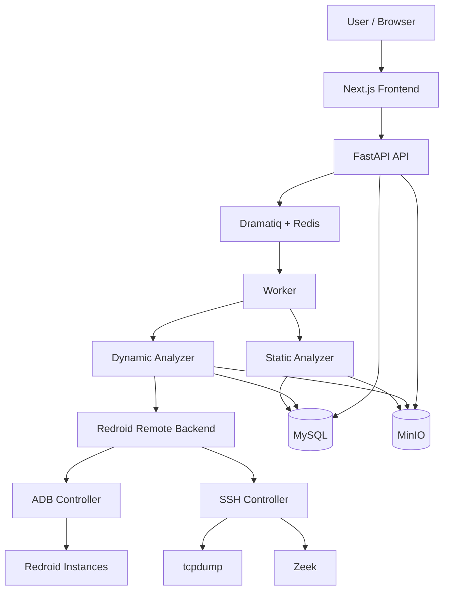
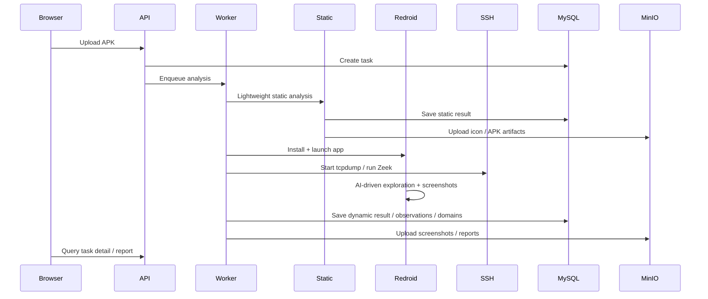

# 网络反诈中心-智能APP分析平台

一个面向反诈场景的 Android App 自动化分析平台。

它提供从 APK 上传、静态信息提取、远端 Android 动态分析、网络行为采集、截图与报告生成，到页面展示的完整闭环。当前动态分析主线基于 **Redroid + ADB + SSH + tcpdump + Zeek**。

## Why This Project

这个项目的核心目标不是做移动应用逆向取证平台，而是为反诈分析提供一条稳定、可批量、可页面化查看的分析流水线，重点产出：

- App 基本信息
- 声明权限与运行期权限申请情况
- 动态运行过程截图
- 域名、IP、命中次数、时间线等网络行为统计
- 可直接查看的任务详情页与报告页

## Core Features

- APK 上传与批量任务创建
- 轻量静态分析
  - 应用名
  - 包名
  - 图标
  - MD5
  - 文件大小
  - 声明权限
  - 启动 Activity 线索
- 远端 Redroid 动态分析
  - 安装 APK
  - 启动 App
  - AI 驱动页面点击、输入、导航与恢复
  - 截图采集
  - UI 结构导出
- 网络行为采集
  - 宿主机 tcpdump 抓包
  - Zeek 解析连接与域名线索
  - 域名 / IP / 命中次数 / 时间线聚合
- 数据持久化
  - MySQL 存结构化分析结果
  - MinIO 存图标、截图、报告、原始 APK
- 页面展示
  - 任务列表页
  - 任务详情页
  - 报告页

## Architecture



## Runtime Flow



## Tech Stack

- Frontend: Next.js
- API: FastAPI
- Queue: Dramatiq + Redis
- Database: MySQL
- Object Storage: MinIO
- Dynamic Backend: Redroid Remote
- Traffic Analysis: tcpdump + Zeek

## Current Supported Runtime Model

当前项目只保留这一条动态分析主线：

- `redroid_remote`
- `ADB + SSH`
- `tcpdump + Zeek`

以下历史方案已废弃，不再是当前实现的一部分：

- Android Docker
- 本地 Android 模拟器池
- MITM / no-mitm / internal proxy 旧链路
- adb reverse 抓包链路
- 后端 HTML 报告主入口

## Quick Start

### 1. Install Dependencies

```bash
python -m venv venv
source venv/bin/activate
pip install -r requirements.txt
```

```bash
cd frontend
npm install
cd ..
```

### 2. Configure Environment

```bash
cp .env.example .env
```

至少需要正确配置：

- MySQL
- Redis
- MinIO
- Redroid 节点 ADB/SSH 信息

### 3. Start Services

```bash
./scripts/start_services.sh
```

Restart:

```bash
./scripts/restart_services.sh
```

Stop:

```bash
./scripts/stop_services.sh
```

### 4. Open the App

- Frontend: `http://127.0.0.1:3000`
- API: `http://127.0.0.1:8000`

## Configuration Highlights

关键环境变量示例：

| Variable | Purpose |
|---|---|
| `ANALYSIS_BACKEND` | 动态分析后端，当前固定为 `redroid_remote` |
| `MYSQL_URL` | MySQL 连接串 |
| `REDIS_BROKER_URL` | Dramatiq Redis Broker |
| `MINIO_ENDPOINT` | MinIO 地址 |
| `REDROID_SSH_HOST` | Redroid 宿主机 SSH 地址 |
| `REDROID_SSH_PORT` | Redroid 宿主机 SSH 端口 |
| `REDROID_SSH_USER` | Redroid 宿主机 SSH 用户 |
| `REDROID_SSH_PASSWORD` / `REDROID_SSH_KEY_PATH` | SSH 认证方式 |
| `REDROID_SLOTS_JSON` | 可用的 Redroid 槽位定义 |
| `ADB_INSTALL_TIMEOUT_SECONDS` | APK 安装超时 |
| `APP_EXPLORATION_MAX_STEPS` | 单轮探索步数上限 |
| `APP_EXPLORATION_TOTAL_ACTION_BUDGET` | 全局操作预算 |
| `APP_EXPLORATION_TOTAL_SCREENSHOT_BUDGET` | 全局截图预算 |

## What Gets Stored

### MySQL

主要表：

- `tasks`
- `static_analysis`
- `dynamic_analysis`
- `analysis_runs`
- `network_requests`
- `master_domains`
- `screenshots`

### MinIO

主要对象：

- 原始 APK
- 应用图标
- 动态截图
- `report.pdf`
- `report_web.html`
- `report_static.html`

## Web UI

### Task List

- 状态
- 应用名 / 包名
- APK 文件名
- 风险等级
- 时间信息

### Task Detail

- 静态分析信息
- 权限信息
- 阶段运行记录
- 域名 / IP / 命中统计
- 截图

### Report

- App 基本信息
- 权限概览
- Top Domains
- Top IPs
- Observation Hits
- 时间线
- 截图索引

## Verification

健康检查：

```bash
curl -s http://127.0.0.1:8000/health
curl -s 'http://127.0.0.1:8000/api/v1/frontend/tasks?page=1&page_size=20'
PYTHONPATH=. ./venv/bin/python scripts/verify_collect_stability.py
```

后端关键测试：

```bash
pytest -q \
  tests/test_redroid_remote_backend.py \
  tests/test_redroid_traffic_collector.py \
  tests/test_redroid_traffic_parser.py
```

前端测试：

```bash
cd frontend
npm test
npm run build
```

## Repository Layout

```text
api/                FastAPI 入口、路由、Schema
core/               配置、数据库、存储
models/             SQLAlchemy 模型
modules/            分析模块、Redroid、流量采集、AI 探索
workers/            Dramatiq worker 与任务执行
frontend/           Next.js 前端
tests/              pytest 测试
templates/          报告模板
scripts/            启停与校验脚本
```

## Status

当前项目已经验证：

- 页面上传 APK
- 轻量静态分析
- Redroid 远端动态分析
- tcpdump + Zeek 网络观测
- 域名 / IP 统计落库
- 截图落库
- 详情页与报告页展示

## Limitations

当前方案重点解决的是：

- 动态运行
- 域名 / IP / 命中次数 / 时间线统计
- 截图与报告展示

当前不以以下能力为目标：

- HTTPS 明文正文
- 完整请求体 / 响应体
- 深度移动逆向取证能力

## Contributing

如果你要在当前主线上继续开发，先确认三点：

1. 不要恢复 Android Docker / 本地模拟器池
2. 不要恢复旧 MITM / no-mitm 运行链路
3. 保持 `redroid_remote` 作为唯一动态分析后端

## License

当前仓库未附带独立开源许可证文件。如需公开发布，请补充明确的许可证类型。
