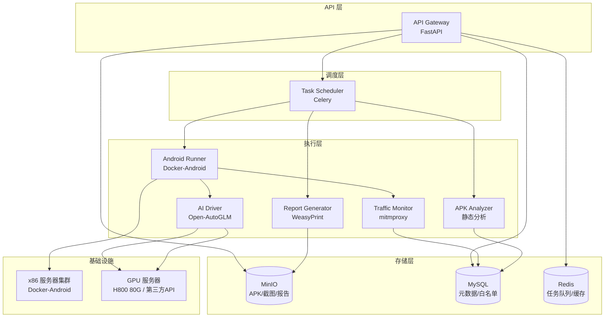
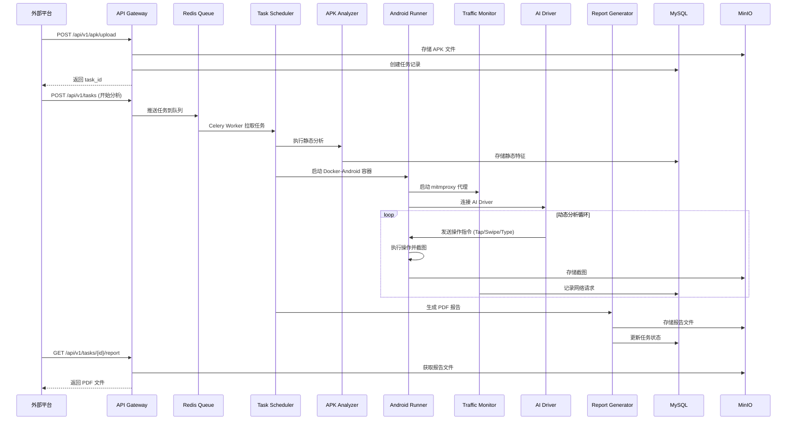
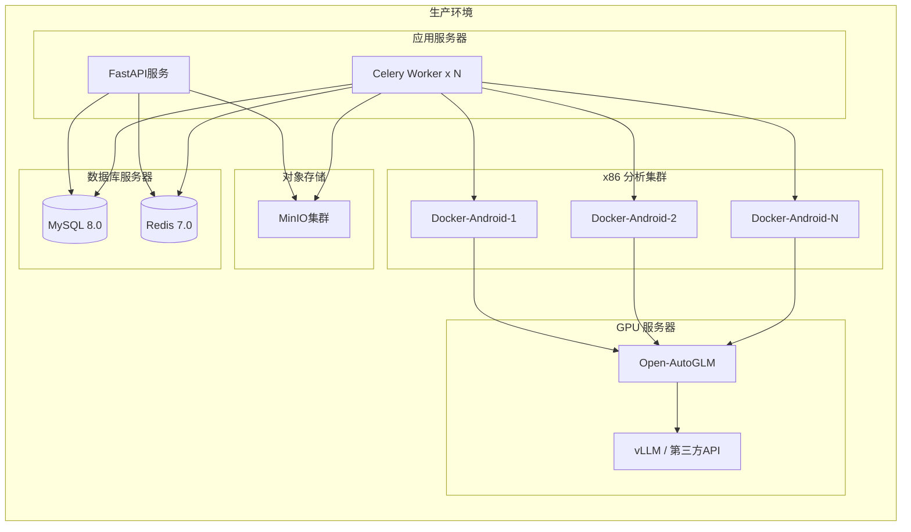
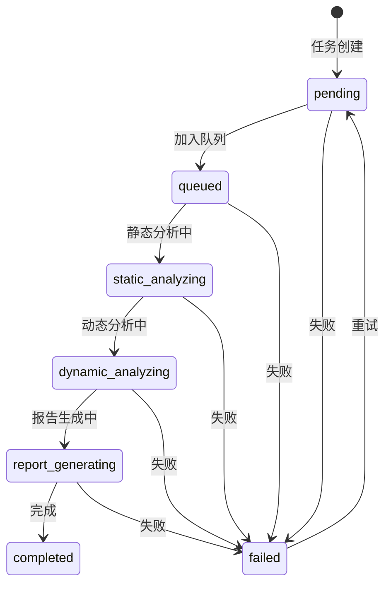
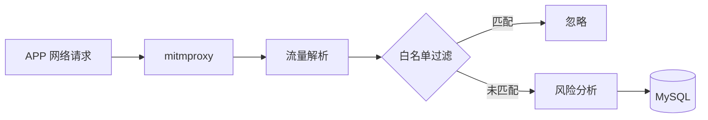

# 产品需求文档 (PRD)：高并发 APK 智能动态分析与网络监控平台

> 版本：v1.0
> 日期：2026-02-18
> 状态：草案

---

## 一、项目概述与目标

### 1.1 项目背景

随着移动互联网的快速发展，涉诈 APP 层出不穷，传统静态分析手段已难以应对加壳、混淆、动态加载等对抗技术。本平台旨在构建一套**智能化的 APK 动态分析系统**，通过 AI 驱动的方式模拟真实用户行为，诱导 APP 暴露核心逻辑，从而精准识别潜在的恶意行为和 C2 通信特征。

### 1.2 核心目标

| 目标 | 描述 |
|------|------|
| **自动化分析** | 支持批量上传 APK，全自动完成静态分析 + 动态运行 + 流量捕获 |
| **AI 驱动交互** | 集成 Open-AutoGLM，模拟真实用户点击、滑动、输入等行为 |
| **精准威胁识别** | 通过网络白名单机制过滤噪声，精准锁定涉诈 C2 域名/IP |
| **专业报告输出** | 生成类似云堤安全服务标准的 PDF 动态分析报告 |

### 1.3 系统边界

```
┌─────────────────────────────────────────────────────────────────┐
│                        系统边界                                   │
├─────────────────────────────────────────────────────────────────┤
│  输入：APK 安装包文件（批量上传）                                   │
│  输出：PDF 动态分析报告 + 结构化分析数据                            │
│  接口：RESTful API（供外部平台调用）                                │
│  环境：x86 服务器 + docker-android + GPU 服务器（AI 推理）          │
└─────────────────────────────────────────────────────────────────┘
```

---

## 二、平台系统架构

### 2.1 整体架构图



### 2.2 数据流架构



### 2.3 部署架构



---

## 三、核心功能模块拆解

### 3.1 模块清单

| 模块编号 | 模块名称 | 职责描述 | 优先级 | 独立程度 |
|----------|----------|----------|--------|----------|
| M01 | API Gateway | RESTful 接口服务 | P0 | ⭐⭐⭐ |
| M02 | Task Scheduler | Celery 任务调度管理 | P0 | ⭐⭐⭐ |
| M03 | Storage Manager | MinIO 对象存储封装 | P0 | ⭐⭐⭐ |
| M04 | APK Analyzer | 静态分析引擎 | P0 | ⭐⭐⭐ |
| M05 | Android Runner | Docker-Android 容器管理 | P0 | ⭐⭐ |
| M06 | Traffic Monitor | mitmproxy 流量捕获 | P0 | ⭐⭐ |
| M07 | AI Driver | Open-AutoGLM 集成 | P0 | ⭐⭐ |
| M08 | Whitelist Manager | 网络白名单管理 | P1 | ⭐⭐⭐ |
| M09 | Report Generator | PDF 报告生成 | P0 | ⭐⭐⭐ |

### 3.2 模块详细设计

#### M01 - API Gateway

**职责**：提供统一的 RESTful API 入口

**接口清单**：

| 方法 | 路径 | 描述 |
|------|------|------|
| POST | `/api/v1/apk/upload` | 上传 APK 文件 |
| POST | `/api/v1/tasks` | 创建分析任务 |
| GET | `/api/v1/tasks/{task_id}` | 查询任务状态 |
| POST | `/api/v1/tasks/{task_id}/retry` | 重试失败任务 |
| GET | `/api/v1/tasks/{task_id}/report` | 下载 PDF 报告 |
| GET | `/api/v1/tasks` | 任务列表（分页/筛选） |
| GET | `/api/v1/whitelist` | 获取白名单列表 |
| POST | `/api/v1/whitelist` | 添加白名单规则 |
| PUT | `/api/v1/whitelist/{id}` | 更新白名单规则 |
| DELETE | `/api/v1/whitelist/{id}` | 删除白名单规则 |

**技术栈**：FastAPI + Pydantic + Uvicorn

---

#### M02 - Task Scheduler

**职责**：任务队列管理、状态流转、失败重试

**任务状态机**：



**任务优先级**：
- P0：紧急分析（VIP 任务）
- P1：普通分析
- P2：批量分析

**技术栈**：Celery + Redis

---

#### M03 - Storage Manager

**职责**：MinIO 对象存储的统一封装

**存储结构**：

```
bucket: apk-analysis
├── apks/                    # APK 文件存储
│   └── {task_id}/
│       └── {md5}.apk
├── screenshots/             # 运行截图存储
│   └── {task_id}/
│       ├── step_001.png
│       ├── step_002.png
│       └── ...
└── reports/                 # PDF 报告存储
    └── {task_id}/
        └── report.pdf
```

**技术栈**：minio-py

---

#### M04 - APK Analyzer

**职责**：APK 静态分析

**分析内容**：

| 类别 | 分析项 |
|------|--------|
| 基本信息 | 包名、版本名、版本号、签名、MD5、SHA256、文件大小 |
| 权限分析 | 申请权限列表、危险权限识别、权限组合风险 |
| 组件分析 | Activity、Service、Receiver、Provider 导出检测 |
| 代码特征 | Native 库、加壳检测、混淆检测、敏感 API |

**技术栈**：androguard + apkid

---

#### M05 - Android Runner

**职责**：Docker-Android 容器生命周期管理

**核心功能**：
- 容器创建与销毁
- ADB 连接管理
- APK 安装与卸载
- 截图捕获
- 设备状态监控

**容器配置**：

```yaml
docker-android:
  image: budtmo/docker-android:emulator_11.0
  ports:
    - "6080:6080"  # noVNC
    - "5555:5555"  # ADB
    - "8080:8080"  # mitmproxy
  environment:
    - EMULATOR_DEVICE=Nexus 5
    - WEB_VNC=true
  privileged: true
```

**技术栈**：docker-py + adb-shell

---

#### M06 - Traffic Monitor

**职责**：网络流量捕获与分析

**核心功能**：
- mitmproxy 代理配置
- SSL 证书安装
- 流量实时解析
- 白名单过滤
- 敏感域名/IP 识别

**流量处理流程**：



**技术栈**：mitmproxy

---

#### M07 - AI Driver

**职责**：Open-AutoGLM 集成与操作指令生成

**核心功能**：
- 连接模型服务（vLLM / 第三方 API）
- 截图分析与决策
- 操作指令生成
- 操作执行与验证

**支持的 AI 操作**：

| 操作 | 描述 | 参数 |
|------|------|------|
| `Launch` | 启动应用 | app: 应用包名 |
| `Tap` | 点击坐标 | element: [x, y] |
| `Type` | 输入文本 | text: 输入内容 |
| `Swipe` | 滑动屏幕 | direction: up/down/left/right |
| `Back` | 返回上一页 | - |
| `Home` | 返回桌面 | - |
| `LongPress` | 长按 | element: [x, y] |
| `DoubleTap` | 双击 | element: [x, y] |
| `Wait` | 等待 | duration: 秒数 |

**分析策略**：

```python
ANALYSIS_STRATEGIES = {
    "explore": {
        "description": "探索应用主要功能",
        "steps": ["启动应用", "浏览首页", "点击各菜单", "返回"]
    },
    "permissions": {
        "description": "触发权限申请",
        "steps": ["启动应用", "触发需要权限的功能", "记录权限弹窗"]
    },
    "network": {
        "description": "触发网络请求",
        "steps": ["启动应用", "执行搜索", "加载数据", "查看详情"]
    }
}
```

**技术栈**：Open-AutoGLM + OpenAI API 兼容客户端

---

#### M08 - Whitelist Manager

**职责**：网络白名单的增删改查

**白名单分类**：

| 类别 | 描述 | 示例 |
|------|------|------|
| `system` | 系统底噪 | google.com, gstatic.com |
| `cdn` | 知名 CDN | cloudflare.com, akamai.net |
| `analytics` | 统计服务 | umeng.com, talkingdata.net |
| `ads` | 广告服务 | doubleclick.net, admob.com |
| `third_party` | 第三方 SDK | qq.com (微信分享), weibo.com |
| `custom` | 自定义规则 | 用户自定义域名 |

**白名单数据结构**：

```json
{
  "id": 1,
  "domain": "google.com",
  "category": "system",
  "description": "Google 基础服务",
  "is_active": true,
  "created_at": "2026-02-18T10:00:00Z",
  "updated_at": "2026-02-18T10:00:00Z"
}
```

**技术栈**：MySQL + SQLAlchemy

---

#### M09 - Report Generator

**职责**：PDF 分析报告生成

**报告结构**：

1. **报告概览**
   - 任务 ID
   - 分析时间
   - APK 文件信息摘要

2. **应用基本信息**
   - 包名、版本、签名
   - MD5、SHA256
   - 文件大小

3. **权限分析**
   - 申请权限列表
   - 危险权限标记
   - 权限风险等级

4. **组件分析**
   - Activity 列表（导出状态）
   - Service 列表（导出状态）
   - Receiver 列表（导出状态）
   - Provider 列表（导出状态）

5. **网络行为分析**
   - 请求域名/IP 列表
   - 请求类型（HTTP/HTTPS）
   - 白名单过滤结果
   - 可疑 C2 标记

6. **敏感 API 调用**
   - API 名称
   - 调用次数
   - 风险等级

7. **运行截图**
   - 按步骤展示截图
   - 操作描述

8. **风险总结**
   - 综合风险等级
   - 风险点汇总
   - 处置建议

**技术栈**：WeasyPrint + Jinja2

---

## 四、分析报告字段定义

### 4.1 静态特征字段

#### 4.1.1 基本信息

| 字段名 | 类型 | 描述 | 示例 |
|--------|------|------|------|
| `package_name` | string | 应用包名 | com.example.app |
| `app_name` | string | 应用名称 | 示例应用 |
| `version_name` | string | 版本名 | 1.0.0 |
| `version_code` | integer | 版本号 | 1 |
| `min_sdk` | integer | 最低 SDK | 21 |
| `target_sdk` | integer | 目标 SDK | 33 |
| `file_size` | long | 文件大小（字节） | 52428800 |
| `md5` | string | MD5 哈希 | abc123... |
| `sha256` | string | SHA256 哈希 | def456... |
| `signature` | string | 签名信息 | CN=Example |
| `is_debuggable` | boolean | 是否可调试 | false |
| `is_packed` | boolean | 是否加壳 | false |
| `packer_name` | string | 加壳工具名称 | 360jiagu |

#### 4.1.2 权限信息

| 字段名 | 类型 | 描述 |
|--------|------|------|
| `permission_name` | string | 权限名称 |
| `protection_level` | string | 保护级别（normal/dangerous/signature） |
| `description` | string | 权限描述 |
| `risk_level` | string | 风险等级（low/medium/high） |
| `risk_reason` | string | 风险原因 |

#### 4.1.3 组件信息

| 字段名 | 类型 | 描述 |
|--------|------|------|
| `component_type` | string | 组件类型（activity/service/receiver/provider） |
| `component_name` | string | 组件完整类名 |
| `is_exported` | boolean | 是否导出 |
| `intent_filters` | array | Intent Filter 列表 |
| `risk_level` | string | 风险等级 |

---

### 4.2 动态特征字段

#### 4.2.1 网络请求

| 字段名 | 类型 | 描述 |
|--------|------|------|
| `request_id` | string | 请求唯一标识 |
| `url` | string | 完整 URL |
| `domain` | string | 域名 |
| `ip` | string | 解析 IP |
| `port` | integer | 端口 |
| `method` | string | HTTP 方法 |
| `is_https` | boolean | 是否 HTTPS |
| `request_time` | datetime | 请求时间 |
| `response_code` | integer | 响应状态码 |
| `content_type` | string | 内容类型 |
| `is_whitelisted` | boolean | 是否在白名单 |
| `whitelist_category` | string | 白名单类别 |
| `risk_level` | string | 风险等级 |
| `risk_reason` | string | 风险原因 |

#### 4.2.2 敏感 API 调用

| 字段名 | 类型 | 描述 |
|--------|------|------|
| `api_name` | string | API 名称 |
| `api_class` | string | 所属类 |
| `call_count` | integer | 调用次数 |
| `first_call_time` | datetime | 首次调用时间 |
| `last_call_time` | datetime | 最后调用时间 |
| `risk_level` | string | 风险等级 |
| `description` | string | 敏感行为描述 |

#### 4.2.3 运行截图

| 字段名 | 类型 | 描述 |
|--------|------|------|
| `screenshot_id` | string | 截图唯一标识 |
| `step_number` | integer | 步骤序号 |
| `operation_type` | string | 操作类型（tap/swipe/type/launch） |
| `operation_detail` | string | 操作详情 |
| `screenshot_path` | string | MinIO 存储路径 |
| `capture_time` | datetime | 截图时间 |
| `ai_description` | string | AI 生成的界面描述 |

---

### 4.3 网络白名单过滤规则

#### 4.3.1 白名单数据表结构

```sql
CREATE TABLE network_whitelist (
    id BIGINT PRIMARY KEY AUTO_INCREMENT,
    domain VARCHAR(255) NOT NULL COMMENT '域名（支持通配符 *）',
    ip_range VARCHAR(50) COMMENT 'IP 范围（CIDR 格式）',
    category ENUM('system', 'cdn', 'analytics', 'ads', 'third_party', 'custom') NOT NULL,
    description VARCHAR(500) COMMENT '描述',
    is_active BOOLEAN DEFAULT TRUE COMMENT '是否启用',
    created_at DATETIME DEFAULT CURRENT_TIMESTAMP,
    updated_at DATETIME DEFAULT CURRENT_TIMESTAMP ON UPDATE CURRENT_TIMESTAMP,
    INDEX idx_domain (domain),
    INDEX idx_category (category),
    INDEX idx_active (is_active)
);
```

#### 4.3.2 预置白名单规则

| 域名/IP | 类别 | 描述 |
|---------|------|------|
| `*.google.com` | system | Google 基础服务 |
| `*.googleapis.com` | system | Google API 服务 |
| `*.gstatic.com` | system | Google 静态资源 |
| `*.cloudflare.com` | cdn | Cloudflare CDN |
| `*.akamai.net` | cdn | Akamai CDN |
| `*.umeng.com` | analytics | 友盟统计 |
| `*.talkingdata.net` | analytics | TalkingData |
| `*.doubleclick.net` | ads | Google 广告 |
| `*.admob.com` | ads | AdMob 广告 |
| `connect.facebook.net` | third_party | Facebook SDK |
| `api.weixin.qq.com` | third_party | 微信 SDK |
| `open.mobile.qq.com` | third_party | QQ SDK |

#### 4.3.3 过滤逻辑

```python
def is_whitelisted(domain: str, ip: str) -> tuple[bool, str]:
    """
    检查域名/IP是否在白名单中

    Returns:
        (is_whitelisted, category)
    """
    # 1. 精确匹配
    rule = db.query(Whitelist).filter(
        Whitelist.domain == domain,
        Whitelist.is_active == True
    ).first()

    if rule:
        return True, rule.category

    # 2. 通配符匹配
    rules = db.query(Whitelist).filter(
        Whitelist.domain.like("%*%"),
        Whitelist.is_active == True
    ).all()

    for rule in rules:
        pattern = rule.domain.replace("*", ".*")
        if re.match(f"^{pattern}$", domain):
            return True, rule.category

    # 3. IP 范围匹配
    if ip:
        rules = db.query(Whitelist).filter(
            Whitelist.ip_range.isnot(None),
            Whitelist.is_active == True
        ).all()

        for rule in rules:
            if ip_in_cidr(ip, rule.ip_range):
                return True, rule.category

    return False, ""
```

---

## 五、技术栈与中间件选型

### 5.1 技术栈总览

| 层级 | 技术选型 | 版本 | 说明 |
|------|----------|------|------|
| **编程语言** | Python | 3.11+ | 与 Open-AutoGLM 技术栈一致 |
| **API 框架** | FastAPI | 0.100+ | 高性能异步框架 |
| **任务调度** | Celery | 5.3+ | 分布式任务队列 |
| **消息队列** | Redis | 7.0+ | Celery Broker |
| **关系数据库** | MySQL | 8.0+ | 元数据存储 |
| **ORM** | SQLAlchemy | 2.0+ | 数据库操作 |
| **对象存储** | MinIO | 最新版 | APK/截图/报告存储 |
| **Android 运行** | docker-android | emulator_11.0 | Android 模拟器 |
| **流量代理** | mitmproxy | 10.0+ | 流量捕获 |
| **AI 驱动** | Open-AutoGLM | 最新版 | 手机 Agent 框架 |
| **模型服务** | vLLM / 第三方 API | - | AutoGLM-Phone-9B |
| **PDF 生成** | WeasyPrint | 60+ | HTML 转 PDF |
| **模板引擎** | Jinja2 | 3.1+ | 报告模板 |

### 5.2 中间件配置

#### 5.2.1 MySQL 配置

```yaml
mysql:
  host: localhost
  port: 3306
  database: apk_analysis
  username: root
  password: ${MYSQL_PASSWORD}
  pool_size: 20
  max_overflow: 10
  charset: utf8mb4
```

#### 5.2.2 Redis 配置

```yaml
redis:
  host: localhost
  port: 6379
  password: ${REDIS_PASSWORD}
  db: 0
  max_connections: 100
```

#### 5.2.3 MinIO 配置

```yaml
minio:
  endpoint: localhost:9000
  access_key: ${MINIO_ACCESS_KEY}
  secret_key: ${MINIO_SECRET_KEY}
  bucket: apk-analysis
  secure: false
```

#### 5.2.4 Celery 配置

```python
CELERY_CONFIG = {
    "broker_url": "redis://localhost:6379/0",
    "result_backend": "redis://localhost:6379/1",
    "task_serializer": "json",
    "result_serializer": "json",
    "accept_content": ["json"],
    "timezone": "Asia/Shanghai",
    "task_acks_late": True,
    "task_reject_on_worker_lost": True,
    "task_time_limit": 3600,  # 1小时超时
    "worker_prefetch_multiplier": 1,
    "worker_max_tasks_per_child": 50,
}
```

### 5.3 GPU 服务器配置

#### 5.3.1 vLLM 部署命令

```bash
python3 -m vllm.entrypoints.openai.api_server \
  --served-model-name autoglm-phone-9b \
  --allowed-local-media-path / \
  --mm-encoder-tp-mode data \
  --mm_processor_cache_type shm \
  --mm_processor_kwargs '{"max_pixels":5000000}' \
  --max-model-len 25480 \
  --chat-template-content-format string \
  --limit-mm-per-prompt '{"image":10}' \
  --model zai-org/AutoGLM-Phone-9B \
  --port 8000 \
  --gpu-memory-utilization 0.9
```

#### 5.3.2 模型配置

```python
MODEL_CONFIG = {
    "base_url": "http://gpu-server:8000/v1",
    "model_name": "autoglm-phone-9b",
    "api_key": "EMPTY",
    "max_tokens": 3000,
    "temperature": 0.1,
    "frequency_penalty": 0.2,
}
```

### 5.4 Docker-Android 配置

```yaml
version: '3.8'

services:
  docker-android:
    image: budtmo/docker-android:emulator_11.0
    privileged: true
    ports:
      - "6080:6080"   # noVNC
      - "5555:5555"   # ADB
      - "8080:8080"   # mitmproxy web
    environment:
      - EMULATOR_DEVICE=Nexus 5
      - WEB_VNC=true
      - APPIUM_PORT=4723
    volumes:
      - /dev/kvm:/dev/kvm
    deploy:
      resources:
        reservations:
          memory: 4G
```

---

## 六、非功能性需求

### 6.1 性能要求

| 指标 | 目标值 |
|------|--------|
| API 响应时间 | < 500ms (P99) |
| 任务队列吞吐量 | 20-50 并发任务 |
| 单个 APK 分析时间 | < 15 分钟 |
| PDF 报告生成时间 | < 30 秒 |

### 6.2 可用性要求

| 指标 | 目标值 |
|------|--------|
| 系统可用性 | 99.5% |
| 任务成功率 | 95%+ |
| 故障恢复时间 | < 10 分钟 |

### 6.3 安全要求

- API 访问需 Token 认证
- 敏感配置（密码、密钥）使用环境变量
- APK 文件隔离存储
- 分析容器网络隔离

---

## 七、附录

### 7.1 项目目录结构

```
apk-analysis-platform/
├── api/                    # API Gateway
│   ├── __init__.py
│   ├── main.py            # FastAPI 入口
│   ├── routers/           # 路由模块
│   │   ├── tasks.py
│   │   ├── whitelist.py
│   │   └── apk.py
│   └── schemas/           # Pydantic 模型
├── core/                   # 核心模块
│   ├── config.py          # 配置管理
│   ├── database.py        # 数据库连接
│   └── storage.py         # MinIO 封装
├── workers/                # Celery Workers
│   ├── __init__.py
│   ├── celery_app.py
│   ├── static_analyzer.py # 静态分析任务
│   ├── dynamic_analyzer.py# 动态分析任务
│   └── report_generator.py# 报告生成任务
├── modules/                # 功能模块
│   ├── apk_analyzer/      # APK 静态分析
│   ├── android_runner/    # Android 容器管理
│   ├── traffic_monitor/   # 流量监控
│   ├── ai_driver/         # AI 驱动层
│   └── report_generator/  # 报告生成
├── models/                 # 数据模型
│   ├── task.py
│   ├── whitelist.py
│   └── analysis_result.py
├── templates/              # 报告模板
│   └── report.html
├── tests/                  # 测试用例
├── docs/                   # 文档
├── requirements.txt
├── docker-compose.yml
└── README.md
```

### 7.2 参考资料

- [Open-AutoGLM GitHub](https://github.com/zai-org/Open-AutoGLM)
- [docker-android](https://github.com/budtmo/docker-android)
- [mitmproxy 文档](https://docs.mitmproxy.org/)
- [androguard 文档](https://androguard.readthedocs.io/)
- [FastAPI 文档](https://fastapi.tiangolo.com/)
- [Celery 文档](https://docs.celeryq.dev/)

---

## 八、版本历史

| 版本 | 日期 | 作者 | 变更说明 |
|------|------|------|----------|
| v1.0 | 2026-02-18 | AI Agent | 初始版本 |

---

> **下一步行动**：基于本 PRD 文档，创建详细的实施计划（Implementation Plan），拆解为可执行的 Agent 任务。
